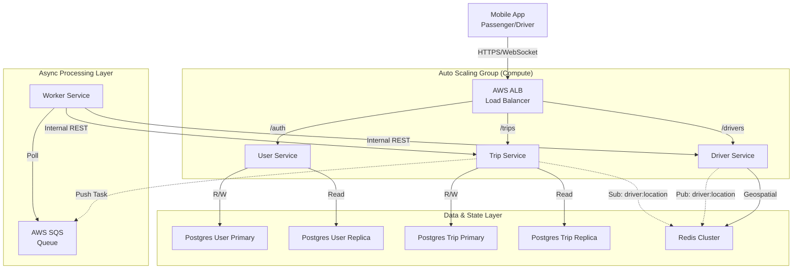

# Kiến trúc hệ thống UIT-GO
---

## 1. Tổng quan

**UIT-GO** là một hệ thống đặt xe (ride-hailing) được xây dựng theo kiến trúc Microservices. Hệ thống được chia thành bốn dịch vụ (services) cốt lõi, mỗi dịch vụ đảm nhận một miền nghiệp vụ (domain) cụ thể, kết hợp với mô hình xử lý bất đồng bộ (Asynchronous Processing) để tối ưu hiệu năng.

Các thành phần được đóng gói bằng Docker và quản lý chung qua `docker-compose.yml` (môi trường Dev) hoặc triển khai trên AWS với Terraform (môi trường Prod). Kiến trúc này tuân theo nguyên tắc Database-per-service, nơi mỗi dịch vụ quản lý cơ sở dữ liệu riêng của mình để đảm bảo tính độc lập và tách biệt.

---

## 2. Các thành phần hệ thống

Hệ thống bao gồm **4 dịch vụ chính** (3 API Services + 1 Worker Service) và hạ tầng cơ sở dữ liệu phân tán.

### 2.1. User Service (Cổng `3000`)

**Tên container:** `user-service`  
**Mô tả:** Dịch vụ này quản lý tất cả các thông tin liên quan đến định danh, xác thực và hồ sơ người dùng (cả hành khách và tài xế).

#### Trách nhiệm chính

- Đăng ký tài khoản (Hành khách, Tài xế).
- Xác thực email qua OTP (One-Time Password) gửi qua email.
- Đăng nhập và cấp phát JWT (Access Token & Refresh Token).
- Quản lý thông tin hồ sơ (`GET /users/me`).
- Quản lý phương tiện (Vehicle) cho tài xế.

#### Công nghệ

- Node.js (JavaScript - ES Module)
- Express
- Prisma
- JWT
- Nodemailer
- Bcrypt

#### Lưu trữ

- **PostgreSQL (`pg_user`)**  
  Lưu trữ dữ liệu chính (`Users`, `Vehicles`, `RefreshTokens`).

- **Redis**  
  Dùng để lưu trữ và quản lý OTP (thời gian sống, số lần gửi).

---

### 2.2. Driver Service (Cổng `3001`)

**Tên container:** `driver-service`  
**Mô tả:** Dịch vụ này chuyên quản lý trạng thái và vị trí của tài xế trong thời gian thực.

#### Trách nhiệm chính

- Nhận cập nhật vị trí (`latitude`, `longitude`) và trạng thái (`ONLINE`, `OFFLINE`) từ tài xế.
- Lưu trữ vị trí của tài xế (đang ONLINE) vào cấu trúc dữ liệu Geospatial của Redis.
- Cung cấp API (`GET /drivers/search`) để tìm kiếm các tài xế ONLINE gần một vị trí nhất định, hỗ trợ loại trừ các tài xế đã từ chối.
- Quản lý "hiện diện" (presence) của tài xế bằng key có thời gian sống (TTL) trong Redis.
- Real-time Broadcasting: Publish vị trí tài xế vào kênh Pub/Sub của Redis để các dịch vụ khác tiêu thụ.

#### Công nghệ

- Node.js (TypeScript)
- Express
- ioredis

#### Lưu trữ

- **Redis**  
  Là kho dữ liệu duy nhất của dịch vụ này.  
  - `GEOADD`, `GEOSEARCH` cho tìm kiếm vị trí.  
  - `SETEX` cho trạng thái online và TTL.

---

### 2.3. Trip Service (Cổng `3002`)

**Tên container:** `trip-service`  
**Mô tả:** Đây là dịch vụ điều phối trung tâm (orchestrator), quản lý toàn bộ vòng đời của một chuyến đi.

#### Trách nhiệm 

- Orchestrator (Điều phối viên) trung tâm. Quản lý vòng đời chuyến đi, kết nối WebSocket với Client.
- Tiếp nhận yêu cầu đặt xe (POST /trips).
- Async Dispatch: Đẩy yêu cầu tìm tài xế vào hàng đợi SQS thay vì xử lý trực tiếp để tránh nghẽn cổ chai.
- Quản lý State Machine chuyến đi (SEARCHING -> DRIVER_FOUND -> ACCEPTED...).
- Xử lý logic khi tài xế chấp nhận (`/accept`), từ chối (`/reject`), bắt đầu (`/start`), hoặc hoàn thành (`/complete`) chuyến đi.
- Xử lý logic "rematch" (tìm tài xế mới) khi tài xế từ chối hoặc hết thời gian chờ (timeout).
- Gửi thông báo thời gian thực (real-time) đến tài xế (`trip:request`) và hành khách (`trip:update`) qua WebSocket.
- Xử lý việc hành khách hủy chuyến (`/cancel`) hoặc đánh giá (`/rating`).
- Real-time Tracking: Subscribe kênh Redis Pub/Sub để nhận toạ độ tài xế và đẩy xuống App hành khách.

#### Công nghệ

- Node.js (TypeScript)
- Express
- Prisma
- Socket.io
- Message Queue: AWS SQS (Producer).

#### Lưu trữ

- **PostgreSQL (`pg_trip`)**  
   cấu hình Primary-Replica.

### 2.4. Worker Service (Background)

**Tên container:** `worker-service`  
**Mô tả:** Dịch vụ chạy nền (Background Worker), không lộ Public API, chuyên xử lý các tác vụ tính toán nặng (Matching Algorithm).

#### Trách nhiệm chính

- **Consumer:** Lắng nghe (Poll) liên tục các message từ hàng đợi **AWS SQS**.
- **Matching Algorithm:** Thực hiện thuật toán tìm kiếm tài xế với bán kính mở rộng (ví dụ: quét 1km -> 3km -> 5km).
- Gọi Internal API của `driver-service` để tìm kiếm và gọi lại `trip-service` (`/internal/trips/...`) để cập nhật kết quả (`driver-found` hoặc `driver-not-found`).
- Đảm bảo tính tin cậy và khả năng mở rộng độc lập cho quy trình matching.

#### Công nghệ

- Node.js (TypeScript)
- AWS SDK (SQS Client)
- Axios (HTTP Client)

---
## 3. Lưu trữ dữ liệu & Hạ tầng (Data Storage & Infrastructure)

Kiến trúc này sử dụng các thành phần lưu trữ và hạ tầng phân tán:

### 3.1. Cơ sở dữ liệu (PostgreSQL - RDS)

- **Mô hình:** Primary-Replica (Master-Slave Replication).
- **Primary:** Xử lý các tác vụ Ghi (`INSERT`, `UPDATE`, `DELETE`).
- **Replica:** Xử lý các tác vụ Đọc (`SELECT`) để giảm tải cho Primary.
- **Ứng dụng:** Cả `pg_user` và `pg_trip` đều áp dụng mô hình này thông qua `@prisma/extension-read-replicas`.

### 3.2. Redis & Redis Pub/Sub (ElastiCache)

- **Geospatial Store:** Lưu trữ vị trí tài xế tối ưu cho truy vấn không gian.
- **Pub/Sub:** Kênh `driver:location` dùng để truyền tải vị trí thời gian thực từ `driver-service` sang `trip-service` mà không cần gọi API liên tục (giảm độ trễ).
- **Cache/OTP:** Lưu trữ dữ liệu tạm thời cho User Service.

### 3.3. Message Queue (AWS SQS)

- Giúp tách rời (`decouple`) quá trình nhận yêu cầu (Trip Service) và quá trình xử lý tìm kiếm (Worker Service).
- Đảm bảo không mất đơn hàng ngay cả khi hệ thống xử lý bị quá tải (Bursty Traffic).

### 3.4. Load Balancing & Auto Scaling (AWS)

- **AWS ALB:** Cổng vào duy nhất, điều hướng traffic dựa trên đường dẫn (`/auth`, `/drivers`, `/trips`).
- **Auto Scaling Group (ASG):** Tự động tăng/giảm số lượng EC2 instances dựa trên mức sử dụng CPU (Target: 50%).

---
## 4. Luồng giao tiếp (Communication Flows)

### 4.1. Client ↔ Services (API)

- **Phương thức:** HTTP REST API (qua HTTPS).
- **Mô tả:** Người dùng tương tác qua ALB. ALB điều hướng đến đúng service.
- **Xác thực:** JWT (Bearer Token) được cấp bởi `user-service` và xác thực tại Gateway hoặc từng Service.

---

### 4.2. Service → Client (Real-time & Tracking)

- **Phương thức:** WebSocket (Socket.io).
- **Mô tả:** `trip-service` duy trì kết nối WebSocket để:
    1.  Đẩy thông báo trạng thái chuyến đi (`trip:update`, `trip:request`).
    2.  **Real-time Tracking:** Đẩy vị trí tài xế (`driver:move`) cho hành khách đang trong chuyến đi.

#### Luồng Tracking Vị trí:
1.  Tài xế gửi `PUT /location` lên `driver-service`.
2.  `driver-service` Publish vào Redis channel `driver:location`.
3.  `trip-service` (Subscribe sẵn) nhận message -> Kiểm tra Room -> Emit xuống Client qua WebSocket.

---

### 4.3. Luồng Tìm kiếm Tài xế (Asynchronous Matching)

Đây là luồng nghiệp vụ quan trọng nhất đã được chuyển sang xử lý bất đồng bộ:

1.  **Hành khách** gọi `POST /trips` tới `trip-service`.
2.  `trip-service`:
    - Tạo Trip trong DB (`status: SEARCHING`).
    - Gửi event (chứa TripID, Toạ độ) vào **AWS SQS**.
    - Trả về ngay lập tức `201 Created` cho Client.
3.  `worker-service` (đang poll SQS) nhận message.
4.  `worker-service` thực hiện vòng lặp gọi `GET /drivers/search` tới `driver-service` với bán kính tăng dần (1km, 3km, 5km...).
5.  **Kết quả:**
    - *Tìm thấy:* Worker gọi `POST /internal/trips/{id}/driver-found` tới `trip-service`.
    - *Không tìm thấy:* Worker gọi `POST /internal/trips/{id}/driver-not-found` tới `trip-service`.
6.  `trip-service` cập nhật DB và bắn WebSocket `trip:request` tới tài xế (nếu tìm thấy).

---

## 5. Luồng nghiệp vụ chính (Vòng đời chuyến đi)

### 5.1. Tài xế Online
1.  Tài xế gửi `PUT /drivers/{id}/location` (`status: "ONLINE"`) tới `driver-service`.
2.  `driver-service` lưu Geo vào Redis và Publish event location.

### 5.2. Hành khách Đặt xe (Async)
1.  Hành khách gửi `POST /trips`.
2.  `trip-service` ghi nhận, tạo record DB và đẩy task sang SQS. Client nhận phản hồi ngay lập tức.

### 5.3. Worker Tìm kiếm
1.  `worker-service` lấy task từ SQS.
2.  Gọi `driver-service` tìm tài xế gần nhất.
3.  Báo kết quả về `trip-service` thông qua Internal API.
4.  `trip-service` thông báo cho tài xế qua WebSocket.

### 5.4. Tài xế Phản hồi (Accept/Reject)
- **Accept:** `trip-service` cập nhật trạng thái `ACCEPTED`, thông báo khách hàng.
- **Reject/Timeout:**
    1.  `trip-service` ghi nhận vào bảng `TripRejectedDriver`.
    2.  `trip-service` **gửi lại một message mới vào SQS** kèm danh sách `excludeDriverIds`.
    3.  `worker-service` nhận message mới và tìm kiếm lại (Rematch), tự động loại trừ tài xế cũ.

### 5.5. Hoàn thành & Đánh giá
1. Tài xế lần lượt gửi `POST /start` và `POST /complete` đến `trip-service`.
2. `trip-service` cập nhật trạng thái và thông báo cho hành khách.
3. Hành khách gửi `POST /rating` để đánh giá chuyến đi.

---

## 6. Sơ đồ Kiến trúc Hệ thống (System Architecture)

Sơ đồ minh họa kiến trúc Microservices kết hợp Event-Driven của UIT-GO:


---

## 7. Cấu trúc Thư mục (Project Structure)

Dự án được tổ chức theo cấu trúc **monorepo**, với mỗi dịch vụ là một thư mục con độc lập trong `services/`.

```text
uit-go/
├── docker-compose.yml     # Định nghĩa và liên kết tất cả các services và DB
├── README.md              # Hướng dẫn chung
├── docs/
│   └── images/            # Hình ảnh minh họa cho README
├── infra/                 # (Dành cho cấu hình hạ tầng, ví dụ Terraform)
│   └── text.txt
└── services/
    ├── driver-service/    # (Service 3001: Quản lý vị trí tài xế)
    │   ├── src/
    │   │   ├── api/         # Định tuyến (routes)
    │   │   ├── controller/  # Xử lý request/response
    │   │   ├── service/     # Logic nghiệp vụ (repo, driver, search)
    │   │   ├── app.ts       # Khởi tạo Express app
    │   │   ├── index.ts     # Entry point, khởi động server
    │   │   └── redis.ts     # Khởi tạo Redis client
    │   ├── Dockerfile
    │   ├── package.json
    │   └── tsconfig.json
    │
    ├── trip-service/      # (Service 3002: Điều phối chuyến đi)
    │   ├── prisma/
    │   │   ├── migrations/   # Lịch sử thay đổi CSDL
    │   │   └── schema.prisma # Định nghĩa schema CSDL (Trip, Rating)
    │   ├── src/
    │   │   ├── controllers/  # Xử lý request/response (trip, health)
    │   │   ├── lib/          # Thư viện dùng chung (axios, emitter)
    │   │   ├── middlewares/  # (auth, error handling)
    │   │   ├── services/     # Logic nghiệp vụ (trip, driver, websocket)
    │   │   ├── app.ts        # Entry point, khởi tạo Express + Socket.io
    │   │   ├── index.ts      # Định tuyến (routes) chính
    │   │   └── ...
    │   ├── Contract.txt      # Hợp đồng API của service
    │   ├── Dockerfile
    │   ├── package.json
    │   └── tsconfig.json
    ├── worker-service/      
    │   ├── src/
    │   │   ├── index.ts      # Định tuyến (routes) chính
    │   │  
    │   ├── Dockerfile
    │   ├── package.json
    │   └── tsconfig.json
    └── user-service/      # (Service 3000: Quản lý người dùng)
        ├── prisma/
        │   ├── migrations/
        │   └── schema.prisma # Định nghĩa schema CSDL (User, Vehicle)
        ├── src/
        │   ├── controllers/  # (auth, user)
        │   ├── lib/          # (mailer, redis)
        │   ├── middlewares/  # (auth)
        │   ├── routes/       # (auth, users)
        │   ├── utils/        # (otp helpers)
        │   ├── index.js      # Entry point, khởi động server
        │   └── prismaClient.js
        ├── Dockerfile
        └── package.json
```

---
