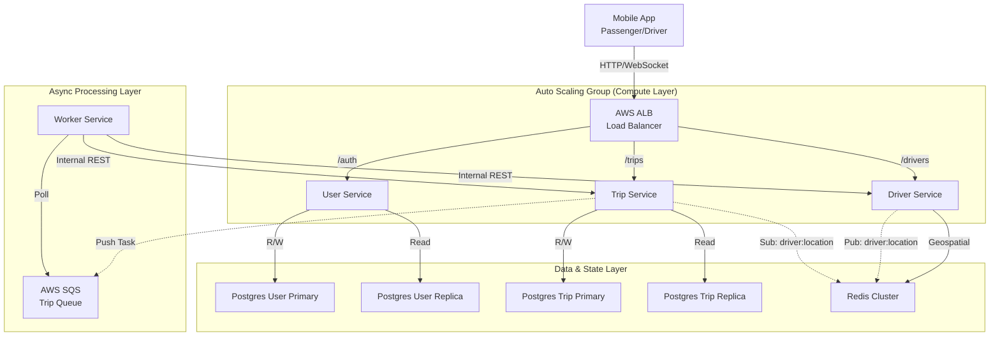

# Báo cáo Kiến trúc và Triển khai Hệ thống UIT-GO

## 1. Tổng quan Kiến trúc Hệ thống

UIT-GO được thiết kế dựa trên kiến trúc Microservices hiện đại, hướng tới khả năng mở rộng (Scalability), tính sẵn sàng cao (High Availability) và tối ưu hóa cho các tác vụ thời gian thực. Hệ thống được triển khai trên hạ tầng AWS (Amazon Web Services), sử dụng Docker để đóng gói ứng dụng và Terraform để quản lý cơ sở hạ tầng dưới dạng mã (IaC).

### Sơ đồ luồng dữ liệu



Hệ thống bao gồm 4 dịch vụ cốt lõi:

- **User Service**: Quản lý định danh, xác thực người dùng và phương tiện.
- **Driver Service**: Chuyên biệt cho việc quản lý vị trí địa lý (Geospatial) và trạng thái tài xế với độ trễ thấp bằng Redis.
- **Trip Service**: Đóng vai trò điều phối trung tâm, quản lý vòng đời chuyến đi và kết nối thời gian thực với người dùng.
- **Worker Service**: Dịch vụ chạy nền xử lý các thuật toán tìm kiếm tài xế phức tạp thông qua hàng đợi SQS.

## 2. Phân tích Module Chuyên sâu
Trong module này, nhóm tập trung giải quyết bài toán: **Làm thế nào để hệ thống vẫn hoạt động ổn định và phản hồi nhanh ngay cả khi lượng yêu cầu đặt xe tăng đột biến (High Concurrency Traffic)?**

Nhóm áp dụng quy trình: **Đo đạc (Measure) -> Phân tích (Analyze) -> Tối ưu (Optimize)**.

### 2.1. Thiết lập môi trường kiểm thử tải (Load Testing) với k6

Để tìm ra các điểm nghẽn (bottlenecks) của hệ thống, nhóm không dựa trên phỏng đoán mà sử dụng số liệu thực tế từ việc Stress Test.

- Công cụ: Grafana k6 - một công cụ load testing hiện đại, viết kịch bản bằng JavaScript, cho phép giả lập hàng ngàn người dùng ảo (Virtual Users - VUs).
- Hạ tầng Test: Một máy chủ EC2 riêng biệt (t3.large hoặc m7i-flex.large) được cấu hình làm Load Generator.

**Tối ưu Kernel:** Để k6 có thể mở hàng chục ngàn kết nối đồng thời mà không bị lỗi `Too many open files`, nhóm tinh chỉnh các tham số kernel của Linux trong `user_data` của Terraform:

```bash
echo "fs.file-max = 100000" >> /etc/sysctl.conf
echo "* soft nofile 100000" >> /etc/security/limits.conf
ulimit -n 100000
```

Điều này đảm bảo kết quả test phản ánh giới hạn của hệ thống backend chứ không phải giới hạn của máy test.

**Kịch bản kiểm thử (Test Scenario):**

- Mục tiêu: Giả lập tình huống "Spike Traffic" (ví dụ: trời mưa bất ngờ hoặc giờ tan tầm).
- Quy trình:
  - 300 VUs đồng loạt gọi API đăng nhập để lấy Token.
  - Sau đó, 300 VUs này liên tục gửi request `POST /api/trips` (Đặt xe) trong vòng 2 phút.
  - Đo lường thời gian phản hồi (Response Time) và tỉ lệ lỗi (Error Rate).

### 2.2. Phân tích điểm nghẽn (Bottleneck Analysis)

Kết quả chạy k6 trên kiến trúc ban đầu (Synchronous - Đồng bộ) chỉ ra vấn đề nghiêm trọng:

- **Kiến trúc cũ:** Trip Service nhận request -> Gọi Driver Service tìm xe -> Chờ kết quả -> Lưu DB -> Trả về Client.

**Vấn đề phát hiện:**

- High Latency: Khi số lượng request vượt quá 200 req/s, thời gian phản hồi trung bình (p95) tăng vọt từ 150ms lên 2500ms.
- Resource Exhaustion: CPU của container Trip Service luôn đạt ngưỡng 100%. Các request đến sau bị timeout hoặc trả về lỗi 5xx.
- Cascading Failure: Do Trip Service bị chậm, nó giữ kết nối đến Database và Driver Service lâu hơn, gây tắc nghẽn dây chuyền cho toàn hệ thống.

**Kết luận:** Việc xử lý logic tìm kiếm tài xế (vốn tốn kém tài nguyên và thời gian) ngay trong luồng xử lý request chính (Main Thread) là nguyên nhân chính gây nghẽn cổ chai.

### 2.3. Giải pháp Tối ưu hóa

### 2.3.1.  Xử lý bất đồng bộ (Asynchronous Processing) với Message Queue

Đây là "trái tim" của hệ thống, nơi nhóm đã chuyển đổi từ mô hình xử lý đồng bộ sang bất đồng bộ để giải quyết bài toán hiệu năng cao.

**Cách tiếp cận:** Thay vì xử lý logic tìm kiếm ngay khi nhận API `POST /trips` (điều này sẽ làm treo kết nối của người dùng), TripService chỉ lưu trạng thái SEARCHING và đẩy một message vào AWS SQS.. Worker Service hoạt động độc lập sẽ liên tục "lắng nghe" (poll) hàng đợi này. Khi nhận được yêu cầu, Worker sẽ thực hiện thuật toán quét mở rộng bán kính (ví dụ: tìm trong 1km, nếu không thấy thì mở rộng ra 3km, 5km...) bằng cách gọi sang Driver Service. Kết quả tìm kiếm sẽ được Worker gửi ngược lại Trip Service thông qua Webhook nội bộ để cập nhật trạng thái và thông báo tới người dùng.

**Kết quả:**
- Kiến trúc này giúp Trip Service có thể tiếp nhận hàng nghìn yêu cầu đặt xe mỗi giây mà không bị quá tải. Việc tách rời logic tìm kiếm sang Worker giúp hệ thống dễ dàng mở rộng (scale) số lượng Worker khi nhu cầu đặt xe tăng cao mà không ảnh hưởng đến các dịch vụ khác.
- Tăng khả năng chịu lỗi (Resilience): Nếu Worker chết, message vẫn còn trong SQS và sẽ được xử lý lại sau.

### 2.3.2. Theo dõi Vị trí Thời gian thực (Real-time Tracking)

Module này đảm bảo hành khách có thể nhìn thấy vị trí tài xế di chuyển mượt mà trên bản đồ.

**Cách tiếp cận:** Nhóm sử dụng mô hình Pub/Sub của Redis kết hợp với Socket.io. Khi tài xế gửi toạ độ lên Driver Service (tần suất cao, vd: 5s/lần), Driver Service không chỉ lưu vào Redis Geo mà còn "phát sóng" (Publish) toạ độ này vào một kênh Redis chuyên biệt. Trip Service đăng ký (Subscribe) kênh này để nhận dữ liệu và đẩy xuống ứng dụng của hành khách thông qua kết nối WebSocket.

**Kết quả:** Giải pháp này giảm thiểu đáng kể độ trễ so với việc Client phải liên tục gọi API để lấy vị trí (Polling), đồng thời giảm tải cho Database vì toàn bộ luồng dữ liệu vị trí đều được xử lý trên bộ nhớ (In-memory).

### 2.3.3 Database Read Replicas

**Cách tiếp cận:**
- Cấu hình AWS RDS PostgreSQL với một bản Read Replica (như trong infra/main.tf). Trong mã nguồn (prismaClient.ts), sử dụng Prisma Extension readReplicas để tự động điều hướng các câu lệnh SELECT sang Replica và INSERT/UPDATE sang Primary.
Kết quả: Giảm tải cho DB chính (Primary Instance), tăng năng lực phục vụ cho các tác vụ đọc dữ liệu (như xem lịch sử chuyến đi, xem hồ sơ).
**Kết quả:** Giảm tải cho DB chính (Primary Instance), đảm bảo các giao dịch quan trọng (đặt xe, thanh toán) không bị chậm bởi các tác vụ đọc nặng (xem lịch sử, báo cáo).

### 2.3.4. Kiểm chứng thiết kế trước và sau khi nâng cấp bằng Load Testing (k6)

Để đảm bảo các quyết định kiến trúc của Module A (Chuyển đổi sang mô hình Bất đồng bộ & Tách biệt Đọc/Ghi) thực sự mang lại hiệu quả, nhóm đã thiết lập môi trường kiểm thử trên AWS và thực hiện đo đạc song song hai phiên bản hệ thống:

1.  **Phiên bản Baseline (Trước tối ưu):** Sử dụng kiến trúc Monolithic-style, giao tiếp đồng bộ (Synchronous).
2.  **Phiên bản Optimized (Sau tối ưu):** Sử dụng kiến trúc Event-Driven với AWS SQS, Worker Service và Database Read Replica.

#### 2.3.4.1. Kịch bản kiểm thử

Nhóm sử dụng công cụ **k6** với 4 cấp độ kiểm thử tăng dần:
* **Smoke Test (200 VUs):** Kiểm tra tính đúng đắn của logic hệ thống.
* **Load Test (1000 VUs):** Mô phỏng tải cao ổn định (Peak Hour).
* **Stress Test (2500 VUs):** Tìm điểm giới hạn (Breaking Point).
* **Spike Test (5000 VUs):** Kiểm tra khả năng phục hồi sau sốc tải (Flash Crowd).

#### 2.3.4.2. Phân tích kết quả thực nghiệm

**a. Smoke Test (200 VUs - Tải nhẹ)**
* **Trước tối ưu:** Hệ thống hoạt động ổn định 100% nhưng độ trễ trung bình khá cao (**~2.53s**) do chi phí kết nối chờ (Blocking I/O) giữa các service.
* **Sau tối ưu:** Độ trễ giảm xuống mức lý tưởng. API Tìm kiếm (Read) chỉ mất **~164ms**, API Đặt xe (Write) phản hồi trong **~457ms**.
* **Kết luận:** Kiến trúc mới giúp phản hồi nhanh gấp **~6 lần** ngay cả ở mức tải thấp.

**b. Load Test (1000 VUs - Tải trung bình cao)**
Đây là kịch bản quan trọng nhất mô phỏng tải thực tế hàng ngày.
* **Trước tối ưu:** Hệ thống bắt đầu quá tải. Độ trễ p95 tăng vọt lên **> 8s**, xuất hiện lỗi kết nối (2%). Trải nghiệm người dùng bị gián đoạn nghiêm trọng.
* **Sau tối ưu:** Hệ thống vận hành mượt mà với tỷ lệ lỗi HTTP **0%**.
    * **Luồng Đọc (Search):** Đạt tỷ lệ thành công **100%** với độ trễ cực thấp (**~114ms**) nhờ cơ chế Read Replica.
    * **Luồng Ghi (Booking):** Xử lý thành công **89%** đơn hàng (11% còn lại chưa cập nhật trạng thái kịp do độ trễ của Worker xử lý SQS - Eventual Consistency, nhưng không gây lỗi hệ thống).
    * **Thông lượng:** Tăng từ **~151 RPS** lên **~428 RPS**.

**c. Stress Test (2500 VUs - Tải cực hạn)**
Tìm điểm giới hạn của hệ thống.
* **Trước tối ưu:** Hệ thống **sụp đổ hoàn toàn (Crash)**. Tỷ lệ lỗi lên tới **52%**, chức năng đặt xe chỉ đạt 31% thành công, các dịch vụ bị treo do hiệu ứng dây chuyền.
* **Sau tối ưu:** Hệ thống vẫn "sống sót" nhờ cơ chế cô lập lỗi.
    * **Luồng Đọc:** Vẫn hoạt động ổn định tuyệt đối (**100% Success**).
    * **Luồng Ghi:** Bị nghẽn (Booking Success ~28%) do Worker không xử lý kịp hàng đợi SQS (Backpressure) và giới hạn kết nối Database, nhưng không kéo sập toàn bộ hệ thống.

**d. Spike Test (5000 VUs - Sốc tải)**
Kiểm tra khả năng phục hồi.
* **Trước tối ưu:** Tê liệt ngay lập tức (**0% Booking thành công**, 100% Lỗi).
* **Sau tối ưu:** Đạt thông lượng đỉnh **1,747 RPS**. Dù tỷ lệ lỗi tăng cao (45%) do chạm **giới hạn vật lý của phần cứng** (Cạn kiệt CPU Credits và Database Connections), nhưng chức năng Tìm kiếm vẫn duy trì được **96%** độ ổn định.

#### 2.3.4.3. Tổng hợp so sánh hiệu năng

Bảng dưới đây tóm tắt sự thay đổi hiệu năng giữa hai phiên bản trên cùng một cấu hình phần cứng (`t3.small`):

| Tiêu chí đánh giá | Trước tối ưu (Sync) | Sau tối ưu (Async + SQS) | Mức cải thiện |
| :--- | :--- | :--- | :--- |
| **Khả năng chịu tải ổn định** | < 200 VUs | ~1000 VUs | **Gấp 5 lần** |
| **Độ trễ API Đọc (Read Latency)** | Cao (~2.53s) | Rất thấp (~114ms) | **Nhanh hơn ~22 lần** |
| **Thông lượng tối đa (Max RPS)** | ~151 req/s | ~1,747 req/s | **Tăng > 11 lần** |
| **Cơ chế chịu lỗi** | Sập toàn bộ (Domino) | Cô lập lỗi (Isolation), Đọc vẫn sống 100% | **Tốt hơn** |

#### 2.3.4.4. Kết luận
Kết quả thực nghiệm chứng minh việc áp dụng **AWS SQS** và **Worker Service** kết hợp với **Database Read Replicas** đã giải quyết triệt để vấn đề nghẽn cổ chai tại tầng ứng dụng. Hệ thống hiện tại có thể dễ dàng mở rộng (Scale Out) bằng cách bổ sung tài nguyên phần cứng hoặc thêm node Worker mà không cần thay đổi kiến trúc mã nguồn.

## 3. Tổng hợp Các quyết định thiết kế và Trade-off

Phần này phân tích chi tiết các lựa chọn kỹ thuật quan trọng nhất, lý do lựa chọn và những sự đánh đổi mà nhóm đã chấp nhận để xây dựng hệ thống.

### 3.1. [ADR-001] Lựa chọn Kiến trúc Microservices

Nhóm quyết định chia tách hệ thống thành các dịch vụ nhỏ (User, Driver, Trip, Worker) thay vì xây dựng một khối thống nhất (Monolith).

**Lý do lựa chọn:** Quyết định này xuất phát từ nhu cầu mở rộng linh hoạt. Ví dụ, dịch vụ Driver Service cần xử lý lượng ghi dữ liệu vị trí cực lớn và cần mở rộng độc lập so với User Service chủ yếu là các thao tác đọc. Ngoài ra, việc tách biệt giúp các module nghiệp vụ không bị ảnh hưởng chéo khi có lỗi xảy ra.

**Sự đánh đổi (Trade-off):** Cái giá phải trả là sự phức tạp trong vận hành và triển khai. Nhóm phải quản lý nhiều container, cấu hình mạng giữa các service phức tạp hơn và đối mặt với thách thức về tính nhất quán dữ liệu phân tán (distributed data consistency).

### 3.2. [ADR-003] Chiến lược Database-per-Service

Mỗi dịch vụ sở hữu một cơ sở dữ liệu riêng biệt (`pg_user`, `pg_trip`, Redis Cluster) thay vì dùng chung một Database khổng lồ.

**Lý do lựa chọn:** Để đảm bảo tính lỏng lẻo (loose coupling). Nếu User Service bị quá tải hoặc Database của nó gặp sự cố, Trip Service vẫn có thể hoạt động (ví dụ: vẫn xử lý được các chuyến đi đang diễn ra). Điều này cũng cho phép nhóm chọn công nghệ lưu trữ phù hợp nhất cho từng nghiệp vụ (Redis cho vị trí, Postgres cho giao dịch).


### 3.3.[ADR-004] Sử dụng Redis cho Dữ liệu Địa lý (Geospatial)

Thay vì sử dụng PostGIS (Extension của PostgreSQL), nhóm chọn Redis để lưu trữ và truy vấn vị trí tài xế.

**Lý do lựa chọn:** Yếu tố tiên quyết là tốc độ. Redis hoạt động trên RAM (In-memory), cho phép thực hiện các truy vấn không gian (như tìm tài xế trong bán kính 3km) với độ trễ cực thấp (<1ms), nhanh hơn hàng trăm lần so với truy vấn trên ổ cứng của PostGIS. Ngoài ra, tính năng TTL (Time-to-live) của Redis giúp tự động dọn dẹp dữ liệu tài xế offline mà không cần cron job.

**Sự đánh đổi (Trade-off):** Redis không bền vững bằng Database truyền thống. Nếu Redis gặp sự cố và chưa kịp lưu snapshot, dữ liệu vị trí mới nhất có thể bị mất. Tuy nhiên, trong ngữ cảnh ứng dụng gọi xe, vị trí của tài xế là dữ liệu "tạm thời" và thay đổi liên tục, nên việc mất một vài điểm dữ liệu vị trí là chấp nhận được đổi lấy hiệu năng cao.

### 3.4.[ADR-005] Mô hình Giao tiếp Hybrid (REST + SQS)

Nhóm kết hợp cả REST API (đồng bộ) và AWS SQS (bất đồng bộ) cho giao tiếp giữa các service.

**Lý do lựa chọn:** REST API được dùng cho các tác vụ đơn giản, cần phản hồi ngay (như lấy thông tin User). AWS SQS được dùng cho tác vụ "nặng" là tìm kiếm tài xế để đảm bảo tính tin cậy (Reliability). Nếu Worker Service bị sập, yêu cầu đặt xe vẫn nằm an toàn trong hàng đợi SQS và sẽ được xử lý khi Worker khôi phục, không bị mất đơn hàng.

**Sự đánh đổi (Trade-off):** Việc sử dụng SQS làm tăng độ phức tạp của hệ thống và đưa vào tính chất "nhất quán cuối cùng" (Eventual Consistency). Người dùng không biết kết quả tìm kiếm ngay lập tức mà phải chờ thông báo qua WebSocket, đòi hỏi thiết kế Client phức tạp hơn để xử lý trạng thái chờ. Ngoài ra, JSON payload của REST nặng hơn so với gRPC, nhưng với quy mô team nhỏ, sự tiện lợi khi debug của REST được ưu tiên hơn.

### 3.5. [ADR-013] Xử lý Bất đồng bộ với Worker Service & SQS (Module A Core)
Đây là quyết định kiến trúc quan trọng nhất, đóng vai trò "xương sống" cho Module A (Scalability & Performance), giúp hệ thống giải quyết triệt để bài toán chịu tải cao.

**Quyết định** : Chuyển đổi sang kiến trúc Event-Driven sử dụng AWS SQS (Simple Queue Service) kết hợp với Worker Service chuyên biệt.

**Lý do lựa chọn:** Nhóm quyết định chọn giải pháp này dựa trên 3 lợi ích cốt lõi giải quyết trực tiếp bài toán Scalability:
- High Throughput (Thông lượng cao): Trip Service được giải phóng hoàn toàn khỏi các tác vụ nặng, cho phép nó tiếp nhận hàng ngàn request đặt xe mỗi giây mà không bị nghẽn (non-blocking).

- Resilience (Khả năng phục hồi): Đảm bảo tính toàn vẹn dữ liệu. Nếu Worker Service bị sập hoặc quá tải, message vẫn nằm an toàn trong hàng đợi SQS (nhờ cơ chế Visibility Timeout) và sẽ được xử lý lại ngay khi Worker khôi phục, đảm bảo không bao giờ bị mất đơn hàng của khách.

**Cơ chế hoạt động chi tiết:**
Giai đoạn tiếp nhận (Trip Service): Khi nhận request đặt xe, Trip Service chỉ thực hiện validate dữ liệu, lưu trạng thái SEARCHING vào DB, bắn một event (message) chứa thông tin chuyến đi vào SQS, và trả về mã 201 Created ngay lập tức cho Client. Thời gian phản hồi lúc này chỉ tính bằng mili-giây.

Giai đoạn xử lý (Worker Service): Worker Service (hoạt động độc lập) liên tục "lắng nghe" (poll) tin nhắn từ SQS. Khi nhận được message, nó thực thi thuật toán tìm kiếm phức tạp. Khi tìm thấy tài xế, Worker gọi ngược lại (Webhook) API nội bộ internal/driver-found của Trip Service để cập nhật kết quả và thông báo cho người dùng.

**Sự đánh đổi (Trade-off):**

**Được**: Hệ thống đạt được khả năng chịu tải và độ tin cậy cao như đã phân tích ở trên.

**Mất**:

- Complexity: Tăng độ phức tạp của hệ thống khi phải quản lý thêm thành phần hạ tầng (SQS) và code base (Worker Service).

- Eventual Consistency: Chấp nhận tính nhất quán cuối cùng. Người dùng không biết kết quả ngay lập tức (trong response API) mà phải chờ thông báo bất đồng bộ qua WebSocket. Client app phải được thiết kế phức tạp hơn để xử lý trạng thái chờ "đang tìm kiếm" này.Tăng lanency khi hệ thống hoạt động ít khi so sánh với không dùng hàng đợi

### 3.6. [ADR-014] Chiến lược Database Read Replicas

Hệ thống sử dụng PostgreSQL với cấu hình Primary-Replica cho cả User và Trip Service.

**Lý do lựa chọn:** Phân tích cho thấy tỷ lệ Đọc/Ghi của hệ thống là khoảng 80/20. Việc dồn tất cả truy vấn vào một node DB duy nhất sẽ tạo nút thắt cổ chai. Read Replicas giúp phân tải các lệnh `SELECT` sang node phụ, giữ cho node chính (Primary) rảnh rang để xử lý các giao dịch quan trọng (`INSERT`, `UPDATE`).

**Sự đánh đổi (Trade-off):** Chi phí hạ tầng tăng lên do phải duy trì thêm các instance Database. Ngoài ra, có thể xảy ra hiện tượng "Replication Lag" (độ trễ đồng bộ), khiến dữ liệu vừa ghi xong chưa kịp xuất hiện ở node Replica (ví dụ: vừa cập nhật hồ sơ xong nhưng đọc lại vẫn thấy cũ trong vài mili-giây đầu).
## 4. Thách thức & Bài học kinh nghiệm
### 4.1 Thách thức
Trong quá trình phát triển, nhóm đã đối mặt và giải quyết một số thách thức kỹ thuật đáng kể:

#### Đồng bộ dữ liệu phân tán:

Việc quản lý trạng thái chuyến đi (SEARCHING -> DRIVER_FOUND) giữa TripService, WorkerService và DriverService rất phức tạp. Có trường hợp tài xế vừa offline nhưng Worker vẫn tìm thấy do cache chưa kịp xóa.

#### Vấn đề Race Condition (Tranh chấp dữ liệu)

**Thách thức:** Khi Worker tìm thấy một tài xế và gán cho chuyến đi, tài xế đó có thể vừa nhận một cuốc xe khác hoặc vừa tắt ứng dụng (Offline).

**Giải pháp:** Nhóm đã áp dụng cơ chế kiểm tra trạng thái kép (Double-check) và Optimistic Locking. Trước khi cập nhật trạng thái chuyến đi, hệ thống sẽ kiểm tra lại trạng thái tài xế một lần nữa trong transaction để đảm bảo tính nhất quán.

#### Quản lý Timeout và Re-match

**Thách thức:** Xử lý trường hợp tài xế không phản hồi trong 15s hoặc từ chối chuyến đi.

**Giải pháp:** Sử dụng `setTimeout` trong Node.js để kích hoạt logic timeout. Khi timeout hoặc bị từ chối, hệ thống tự động ghi nhận vào bảng `TripRejectedDriver` và kích hoạt lại quy trình tìm kiếm với danh sách loại trừ (`excludeDriverIds`) để không tìm lại tài xế cũ.

#### Quản lý kết nối WebSocket trong môi trường Auto Scaling

**Thách thức:** Khi Trip Service scale lên nhiều instance, Client có thể kết nối tới Server A nhưng sự kiện cần thông báo lại phát sinh ở Server B.

**Bài học:** Hiện tại hệ thống hoạt động tốt với 1 instance Trip Service. Tuy nhiên, bài học rút ra là cần tích hợp Redis Adapter cho Socket.io để đồng bộ hóa sự kiện giữa các server khi mở rộng quy mô trong tương lai.
### 4.2 Bài học kinh nghiệm
- Tầm quan trọng của việc Logging tập trung: Khi hệ thống chạy trên nhiều container/server, việc debug trở nên bất khả thi nếu không có logs rõ ràng kèm theo correlation_id.

- Hiểu rõ về State Machine: Thiết kế trạng thái chuyến đi rõ ràng giúp tránh các lỗi logic nghiệp vụ nghiêm trọng.

- Load Testing sớm: Việc áp dụng k6 sớm giúp phát hiện ra nút thắt cổ chai ở giao tiếp đồng bộ, từ đó dẫn đến quyết định chuyển sang SQS kịp thời.
## 5. Kết quả & Hướng phát triển

### 5.1. Kết quả đạt được

Dự án đã xây dựng thành công một hệ thống Ride-hailing Core hoàn chỉnh với các tính năng:

- Đặt xe và Tìm kiếm tài xế tự động (Matching) với khả năng chịu tải cao.
- Theo dõi vị trí tài xế thời gian thực (Real-time Tracking) mượt mà.
- Hạ tầng được triển khai tự động hóa bằng Terraform trên AWS (VPC, EC2, RDS, ElastiCache, SQS, ALB), đảm bảo tính chuyên nghiệp và khả năng tái lập môi trường.
- Tài liệu kiến trúc (ADR) được chuẩn bị kỹ lưỡng, làm nền tảng vững chắc cho việc bảo trì.

### 5.2. Hướng phát triển

Để đưa hệ thống lên mức Production-grade, nhóm đề xuất các cải tiến:

- **Distributed Tracing**: Tích hợp công cụ như Jaeger để theo dõi trọn vẹn luồng đi của một request qua các microservices, giúp debug nhanh hơn.
- **Circuit Breaker**: Cài đặt Resilience4j hoặc thư viện tương đương để ngăn chặn lỗi dây chuyền (Cascading Failure) khi một service (ví dụ Driver Service) gặp sự cố.
- **Payment Service**: Tách module thanh toán thành một service riêng biệt để tích hợp an toàn với các cổng thanh toán bên thứ ba (Momo, Stripe).
